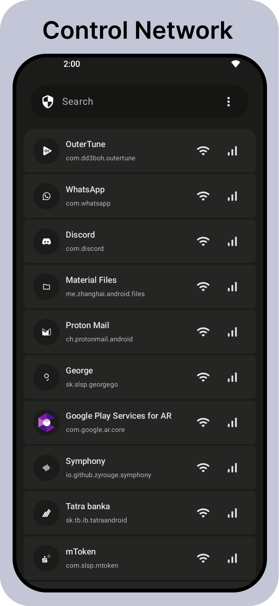
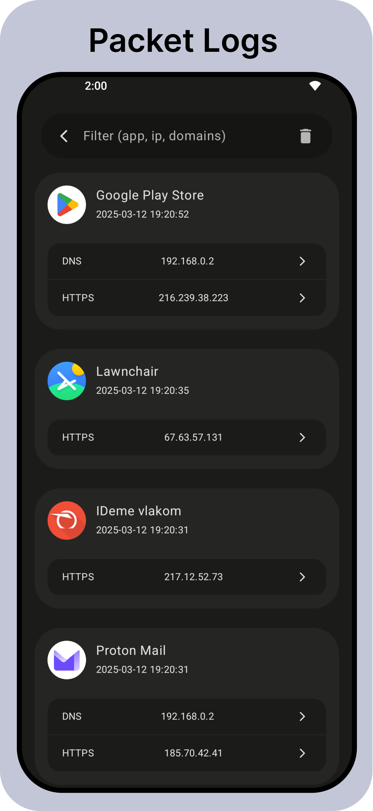
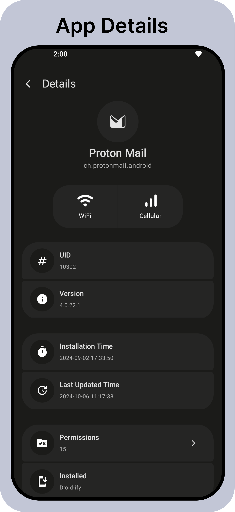
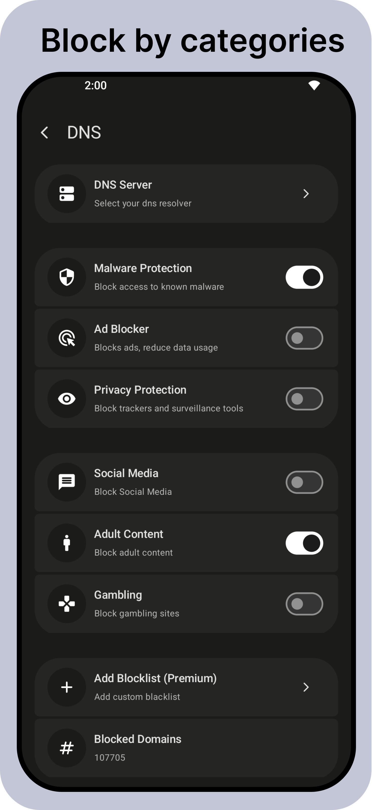

  

    <h1>Athena</h1>
    
Athena is Android Firewall presented in <a target="_blank" href="https://m3.material.io/">Material You</a> style.

     
    &nbsp;
    &nbsp;
    &nbsp;&nbsp;
    &nbsp;

&nbsp;

## About Athena

Athena is an <strong>advanced Android firewall</strong> app designed with <a href="https://m3.material.io/" target="_blank" rel="noopener noreferrer">Material You</a> style, empowering you with full network control and privacy tools. It supports both <strong>VPN</strong> and <strong>root</strong> modes, letting you customize which apps can access the internet with granular filtering options.

### Key Features

- **Root & VPN Support**  
  Flexible network control on any Android device with or without root access.  

- **App-Level Network Control**  
  Allow or block internet access individually for each installed app.  

- **DNS Blocklist Support**  
  System-wide blocking of undesirable content via customizable DNS filters.  

- **Live Network Logs**  
  Real-time monitoring and blocking of outgoing network requests with detailed logs for full transparency.  

- **Advanced Network Protection**  
  Includes malicious site blocking, encrypted DNS, stealth mode, and additional privacy-enhancing utilities.  

- **Detailed App Insights**  
  In-depth network behavior information per app to aid smarter management.  

- **Open Source & Privacy-Focused**  
  Licensed under GPLv3, Athena is transparent, community-driven, and respects user privacy.

## Download

 &nbsp;
 &nbsp;

## Premium Activation

If you prefer not to use Google services for premium purchases, you can buy a premium code securely via Ko-fi:

[https://ko-fi.com/s/b127ca6671](https://ko-fi.com/s/b127ca6671)

Once purchased, enter the premium code in Athena at:

`Settings → About → Premium Code`

Unlock premium features while maintaining full control of your payment method and privacy.

---

## Checksums

To verify your download's integrity, here are the official checksums for the latest release:

| Hash Type | Checksum                                   |
|-----------|--------------------------------------------|
| MD5       | `0d09d0bda26d7d25d9e7365178c6de73`       |
| SHA-1     | `81b71e9a4eaff9596be35c0aae3294beff2ad9f2` |
| SHA-256   | `63efc5b0c015d4855da4a593dacd29ffe63279c0b98d0f80e649103d429414ec` |

---

## Contact & Support

Need help or want to provide feedback? Reach out to us:

- 📧 Email: [contact@easyapps.me](mailto:contact@easyapps.me)  
- 💬 Discord: [Easy Apps Community](https://discord.gg/ZrP4G8z23H)

We welcome your questions, suggestions, and contributions!

---

## Contribution

We welcome contributions from the community to help improve Athena!

To contribute:

1. Fork the repository  
2. Create a new branch (`git checkout -b feature/your-feature`)  
3. Make your changes  
4. Commit your changes (`git commit -m 'Add your feature'`)  
5. Push to your branch (`git push origin feature/your-feature`)  
6. Open a Pull Request

---

## License

Athena is licensed under the [GNU General Public License v3](https://www.gnu.org/licenses/gpl-3.0.html) (GPLv3).
